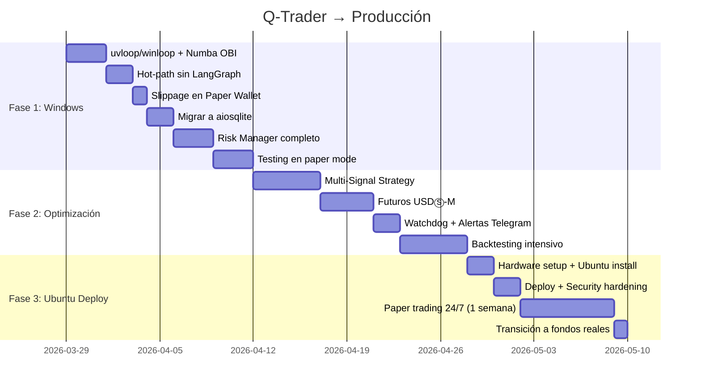

# 🔬 Q-Trader: Análisis Exhaustivo de Viabilidad y Optimización

> **Fecha**: 2026-03-28  
> **Alcance**: Auditoría de arquitectura, viabilidad del proyecto, roadmap de optimización, y estrategia de despliegue en dispositivo dedicado Ubuntu

---

## TL;DR — ¿Es viable el proyecto?

> [!IMPORTANT]
> **SÍ, el proyecto es viable**, pero con matices críticos. La arquitectura actual es sólida para un bot de trading automatizado de **frecuencia media** (no verdadero HFT institucional). Para desplegarlo en un dispositivo dedicado 24/7 con Ubuntu y optimizar la ganancia, se necesitan **3 fases** de mejoras que se detallan más adelante.

El sistema ya tiene los pilares correctos: pipeline agéntico, websockets, paper trading, auditoría, dashboard. Lo que falta es **optimización de rendimiento**, **robustez de producción**, y una **estrategia de trading más sofisticada**.

---

## 1. Auditoría Arquitectónica — Módulo por Módulo

### 1.1 Motor Agéntico: [trade_executor.py](file:///c:/Users/GYNO/Apptrading/core/trade_executor.py)

| Aspecto | Evaluación | Nota |
|:---|:---:|:---|
| Diseño del pipeline 5-estados | ✅ Excelente | PERCEPTION → STRATEGY → VALIDATION → EXECUTION → LOGGING |
| Short-circuits (HOLD → LOG) | ✅ Bien diseñado | Evita nodos innecesarios con `conditional_edges` |
| Auditoría de transiciones | ✅ Completo | Cada cambio de estado se registra |
| Throttle de 10ms entre ticks | ⚠️ Revisar | Podría ser dinámico según carga del CPU |

> [!WARNING]
> **Problema Crítico: LangGraph Overhead**
> 
> LangGraph añade ~10-50ms de overhead por invocación para gestión de estado, serialización y recorrido del grafo. En un contexto donde cada tick del order book dispara `ainvoke()`, esto acumula latencia significativa. Para una estrategia OBI donde la ventana alpha dura milisegundos, este overhead puede anular la ventaja.
> 
> **Recomendación**: Mantener LangGraph para la orquestación de alto nivel (decisiones de riesgo, sentimiento) pero mover el hot-path de ejecución a un state machine nativo en Python puro.

### 1.2 Exchange Client: [exchange_client.py](file:///c:/Users/GYNO/Apptrading/core/exchange_client.py)

| Aspecto | Evaluación | Nota |
|:---|:---:|:---|
| WebSocket con auto-reconnection | ✅ Robusto | Exponential backoff + jitter + rebuild de instancia |
| REST con retry lineal | ✅ Bien | 3 intentos con espera progresiva |
| Uso de ccxt.pro | ⚠️ Aceptable | Añade overhead de abstracción vs API nativa |
| Manejo de errores | ✅ Completo | Diferencia entre errores de red y errores fatales |

> [!NOTE]
> **Sobre CCXT vs API Nativa de Binance**
> 
> CCXT pro es ideal para prototipado y soporte multi-exchange. Sin embargo, para un bot dedicado exclusivamente a Binance, la API nativa (`binance-connector-python`) eliminaría una capa de abstracción y reduciría latencia ~2-5ms por operación. La recomendación es un **enfoque híbrido**: CCXT para market data general, API nativa para ejecución de órdenes.

### 1.3 Order Manager: [order_manager.py](file:///c:/Users/GYNO/Apptrading/core/order_manager.py)

| Aspecto | Evaluación | Nota |
|:---|:---:|:---|
| Maker Post-Only pegging | ✅ Bien diseñado | Lógica de persecución de precio inteligente |
| Detección de drift 0.05% | ✅ Correcto | Cancela y reposiciona en desviaciones |
| Max 3 chases | ✅ Prudente | Evita persecuciones infinitas |
| Monitoreo por WebSocket | ✅ Event-driven | No bloquea el loop principal |

> [!CAUTION]
> **Realidad de Fees en Binance (2025-2026)**
> 
> El sistema asume que operar como Maker tiene comisión 0% ("Maker Rebates"). **Esto NO es cierto para cuentas retail estándar**:
> - Spot Maker fee estándar: **0.10%** (0.075% con descuento BNB)
> - Futuros USDⓈ-M Maker: **0.02%** (VIP 0)
> - Para obtener rebates negativos (que el exchange te pague), se necesita estar en un **Market Maker Program** con volúmenes de >$50M/mes
> 
> **Impacto**: Con 0.075% de comisión por trade (ida y vuelta = 0.15%), una estrategia OBI que captura spread de 0.01-0.05% sería **estructuralmente perdedora**. Esto es el problema #1 de viabilidad financiera del proyecto.

### 1.4 Estrategia OBI: [strategy_base.py](file:///c:/Users/GYNO/Apptrading/core/strategy_base.py)

| Aspecto | Evaluación | Nota |
|:---|:---:|:---|
| Cálculo O(1) por tick | ✅ Eficiente | Suma de volúmenes en N niveles |
| Threshold configurable (0.65) | ✅ Bien | Parámetro ajustable |
| ATR Proxy via spread | ✅ Inteligente | Evita dependencia de datos OHLCV |

> [!WARNING]
> **Limitaciones Estratégicas Serias**
> 
> 1. **Señal demasiado simple**: OBI solo (sin confirmar con flujo de órdenes, momentum, o volumen agresivo) genera muchos falsos positivos en mercados con spoofing
> 2. **Sin decaimiento temporal**: Una señal generada hace 500ms vale lo mismo que una de hace 5ms — debería tener TTL
> 3. **Threshold fijo**: Un threshold de 0.65 que no se adapta a la volatilidad del mercado producirá sobre-trading en mercados calmos y sub-trading en mercados volátiles
> 4. **Sin multi-timeframe**: El OBI solo mira un snapshot del libro, sin contexto del trend de los últimos N ticks

### 1.5 Risk Manager: [risk_manager.py](file:///c:/Users/GYNO/Apptrading/core/risk_manager.py)

| Aspecto | Evaluación | Nota |
|:---|:---:|:---|
| Cooldown entre trades | ✅ Bien | 60s por defecto |
| Max open trades | ✅ Correcto | Cap de 3 |
| Position sizing dinámico | ✅ Inteligente | Inverso a volatilidad con hard caps |
| | ❌ Falta | **No hay drawdown tracking** (MAX_DRAWDOWN_PCT mencionado en docs pero no implementado) |
| | ❌ Falta | **No hay trailing stop** |
| | ❌ Falta | **No hay circuit breaker por velocidad de pérdidas** |

### 1.6 Sentiment Oracle: [sentiment_oracle.py](file:///c:/Users/GYNO/Apptrading/core/sentiment_oracle.py)

| Aspecto | Evaluación | Nota |
|:---|:---:|:---|
| 2-Layer architecture | ✅ Excelente | Keywords O(1) + LLM profundo |
| RSS polling async | ✅ Bien | ThreadedResolver para Windows |
| Fallback safe-by-default | ✅ Prudente | Si LLM falla → no entra en pánico |
| Proveedores pluggables | ✅ Bien diseñado | GeminiProvider / ClaudeProvider |
| Polling cada 5 min | ⚠️ Lento | Para noticias "flash crash" podría ser tarde |

### 1.7 Paper Wallet: [paper_wallet.py](file:///c:/Users/GYNO/Apptrading/core/paper_wallet.py)

| Aspecto | Evaluación | Nota |
|:---|:---:|:---|
| SQLite-persistent | ✅ Sobrevive reinicios | WAL mode |
| Simula fees de Maker | ✅ Configurable | 0.0% por defecto |
| Interface espejo de ExchangeClient | ✅ Drop-in swap | Transparente para el executor |
| PnL summary | ✅ Completo | Buys, sells, fees, unrealized |

> [!TIP]
> El paper wallet debería simular **slippage** y **latencia de ejecución** para resultados más realistas. Actualmente asume fill instantáneo al precio exacto, lo cual sobreestima la ganancia real.

### 1.8 Base de Datos: [db.py](file:///c:/Users/GYNO/Apptrading/services/db.py)

| Aspecto | Evaluación | Nota |
|:---|:---:|:---|
| Dual DB (SQLite + DuckDB) | ✅ Excelente | OLTP + OLAP separados |
| WAL mode en SQLite | ✅ Correcto | Mejor concurrencia de lectura |
| Balance snapshots en DuckDB | ✅ Bien | Columnar para equity curves |
| Índices en action_logs | ✅ Optimizado | ts, level, source |

> [!NOTE]
> **Issue de thread-safety**: `sqlite3.connect(check_same_thread=False)` permite acceso multi-hilo pero SQLite NO es thread-safe para escrituras concurrentes. Las escrituras via `run_in_executor` en threads del pool podrían colisionar. Considerar `aiosqlite` (ya en requirements pero no usado) como reemplazo.

### 1.9 API Server: [api_server.py](file:///c:/Users/GYNO/Apptrading/services/api_server.py)

| Aspecto | Evaluación | Nota |
|:---|:---:|:---|
| FastAPI + WebSocket | ✅ Moderno | Real-time dashboard |
| CORS restringido | ✅ Seguro | Solo localhost |
| Auth JWT | ✅ Implementado | Login con API key |
| Control endpoints (pause/resume/panic) | ✅ Completo | Operacional |
| Swagger deshabilitado | ✅ Seguro para prod | No expone schema |

### 1.10 Deploy: [setup_ubuntu.sh](file:///c:/Users/GYNO/Apptrading/deploy/setup_ubuntu.sh) + [tradingbot.service](file:///c:/Users/GYNO/Apptrading/deploy/tradingbot.service)

| Aspecto | Evaluación | Nota |
|:---|:---:|:---|
| systemd service | ✅ Correcto | `on-failure` restart |
| Security hardening | ✅ Bien | NoNewPrivileges, ProtectSystem, PrivateTmp |
| Resource limits | ✅ Prudente | 512M RAM max, 80% CPU |
| Permisos de .env | ✅ Correcto | chmod 600 |
| | ❌ Falta | **No hay Watchdog** (proceso vivo pero deadlocked no se detecta) |
| | ❌ Falta | **No hay `StartLimitIntervalSec=0`** (limita a 5 reintentos en 5 min) |

---

## 2. Problemas Críticos Identificados

### 🔴 P1: Viabilidad Financiera — Fees vs. Alpha

| Concepto | Valor | Impacto |
|:---|:---|:---|
| Comisión Maker spot Binance (con BNB) | 0.075% | Round-trip: 0.15% |
| Spread típico BTC/USDT | 0.01-0.03% | Alpha disponible |
| **Balance neto por trade** | **-0.12% a -0.14%** | **Negativo** |

**Veredicto**: Con fees estándar retail, el OBI tal como está **no puede ser rentable** en spot. 

**Soluciones viables**:
1. **Operar en Futuros USDⓈ-M** donde Maker fee es 0.02% (round-trip 0.04%) — el alpha del OBI podría superar esto
2. **Aplicar al programa Market Maker de Binance** (requiere volumen significativo)
3. **Cambiar a exchanges con fees más bajos o rebates** (e.g., Bybit, MEXC, Gate.io ofrecen maker rebates más accesibles)
4. **Combinar OBI con señales de mayor alpha** que capturen movimientos de >0.2%

### 🔴 P2: LangGraph como Bottleneck de Latencia

Como se detalló arriba, `ainvoke()` en cada tick añade overhead innecesario. Para el hot-path, un simple pattern de funciones async encadenadas sería 10-50x más rápido.

### 🟡 P3: Estrategia Demasiado Simple para ser Rentable

La OBI sola, sin confirmación de:
- Trade flow imbalance (agresión de compradores vs vendedores)
- Micro-price trend (media ponderada por volumen del top of book)
- VPIN (Volume-Synchronized Probability of Informed Trading)
- Time-weighted decay de la señal

...produce demasiados falsos positivos.

### 🟡 P4: Risk Manager Incompleto

Falta implementar:
- [ ] Drawdown máximo diario/acumulado con kill-switch automático
- [ ] Trailing stop-loss
- [ ] PnL tracking en tiempo real (no solo al completar trades)
- [ ] Rate limiter por pérdida acumulada (e.g., max 3 pérdidas consecutivas → cooldown de 15 min)

### 🟡 P5: Thread-Safety de SQLite

Múltiples coroutines escribiendo a SQLite vía `run_in_executor` usando threads del pool de asyncio pueden causar `database is locked` bajo carga.

---

## 3. Roadmap de Optimización en 3 Fases

### Fase 1: Quick Wins en Windows (1-2 semanas)

Mejoras que se pueden implementar inmediatamente sin cambiar la arquitectura:

#### 1.1 Event Loop de Alto Rendimiento
```python
# En run_bot.py — Windows: usar winloop (port de uvloop para Windows)
# En Ubuntu: usar uvloop (2-4x más rápido que asyncio default)
import sys
if sys.platform == "win32":
    try:
        import winloop
        winloop.install()
    except ImportError:
        pass
else:
    try:
        import uvloop
        uvloop.install()
    except ImportError:
        pass
```
- **`winloop`** (Windows): Port de uvloop basado en libuv → ~2x speedup en I/O
- **`uvloop`** (Linux): Estándar de la industria → ~2-4x speedup

#### 1.2 Optimización de OBI con Numba
```python
import numpy as np
from numba import njit

@njit(cache=True)
def fast_obi(bid_prices, bid_vols, ask_prices, ask_vols, depth):
    """Order Book Imbalance — compilado a código máquina."""
    bid_vol = np.sum(bid_vols[:depth])
    ask_vol = np.sum(ask_vols[:depth])
    total = bid_vol + ask_vol
    if total == 0:
        return 0.0, 0.0
    imbalance = (bid_vol - ask_vol) / total
    atr_proxy = (ask_prices[0] - bid_prices[0]) / bid_prices[0]
    return imbalance, atr_proxy
```
- Reduce el cálculo de ~50μs (Python puro) a ~1-2μs
- `cache=True` evita recompilación al reiniciar

#### 1.3 Hot-Path sin LangGraph
```python
# Opción: usar LangGraph para el setup y non-critical path
# pero ejecutar el hot-path como funciones directas
async def _fast_pipeline(self, ob):
    """Hot-path directo — sin overhead de framework."""
    perception = await self._state_perceive(ob)
    decision = await self._state_strategize(ob, perception)
    
    if decision.signal == Signal.HOLD:
        await self._state_log(decision, ExecutionResult(status="skipped"))
        return
    
    passed = await self._state_validate(decision)
    if not passed:
        await self._state_log(decision, ExecutionResult(status="rejected"))
        return
    
    result = await self._state_execute(decision)
    await self._state_log(decision, result)
```

#### 1.4 Slippage Simulator en Paper Wallet
```python
# Añadir al paper_wallet.py
import random

def _simulate_slippage(self, price: float, signal: Signal) -> float:
    """Simulate realistic execution price."""
    # ±0.01-0.05% slippage basado en distribución normal
    slip_pct = abs(random.gauss(0, 0.0002))  # ~2 bps de media
    if signal == Signal.BUY:
        return price * (1 + slip_pct)  # Peor precio para comprador
    return price * (1 - slip_pct)  # Peor precio para vendedor
```

#### 1.5 Migrar SQLite a aiosqlite
Ya está en `requirements.txt` pero no se usa. Migrar las operaciones de escritura a `aiosqlite` eliminará problemas de thread-safety.

---

### Fase 2: Optimización Profunda (2-4 semanas)

#### 2.1 Estrategia Multi-Signal

Evolucionar de OBI puro a un sistema de señales compuestas:

```
┌─────────────┐   ┌──────────────┐   ┌───────────────┐
│ OBI Signal  │   │ Trade Flow   │   │ Micro-Price   │
│ (imbalance) │   │ (aggression) │   │ (VWAP trend)  │
└──────┬──────┘   └──────┬───────┘   └───────┬───────┘
       │                 │                    │
       └────────────┬────┴────────────────────┘
                    ▼
            ┌───────────────┐
            │ Composite     │
            │ Signal Score  │  → Weighted average con decay temporal
            │ [-1.0, +1.0]  │
            └───────┬───────┘
                    ▼
            ┌───────────────┐
            │ Threshold     │
            │ Adaptativo    │  → Se ajusta según volatilidad (ATR proxy)
            └───────────────┘
```

**Señales adicionales a implementar**:

| Señal | Fórmula | Alpha Esperado |
|:---|:---|:---|
| Trade Flow Imbalance | `(buy_aggression - sell_aggression) / total_volume` | Alto |
| Micro-Price | `(bid_price × ask_vol + ask_price × bid_vol) / (bid_vol + ask_vol)` | Medio |
| Book Pressure Gradient | Cambio de OBI entre ticks consecutivos | Medio |
| Spread Dynamics | Tasa de cambio del spread (contracting = momentum) | Bajo-Medio |

#### 2.2 Drawdown Manager Completo

```python
class DrawdownManager:
    def __init__(self, max_daily_loss_pct=0.02, max_total_loss_pct=0.05):
        self.peak_balance = 0
        self.daily_start_balance = 0
        self.max_daily_loss_pct = max_daily_loss_pct
        self.max_total_loss_pct = max_total_loss_pct
    
    def check(self, current_balance: float) -> tuple[bool, str]:
        """Returns (trade_allowed, reason)"""
        # Daily drawdown
        daily_loss = (self.daily_start_balance - current_balance) / self.daily_start_balance
        if daily_loss >= self.max_daily_loss_pct:
            return False, f"Daily drawdown limit hit: {daily_loss:.2%}"
        
        # Max drawdown from peak
        drawdown = (self.peak_balance - current_balance) / self.peak_balance
        if drawdown >= self.max_total_loss_pct:
            return False, f"Max drawdown limit hit: {drawdown:.2%}"
        
        return True, "OK"
```

#### 2.3 Futuros USDⓈ-M (Reducción de Fees)

Migrar la ejecución a futuros perpetuos de Binance donde los fees son significativamente menores:

| Fee Type | Spot | Futuros (VIP 0) | Diferencia |
|:---|:---:|:---:|:---:|
| Maker | 0.10% | 0.02% | 5x menor |
| Taker | 0.10% | 0.05% | 2x menor |
| Con BNB discount | 0.075% | 0.018% | 4x menor |
| Round-trip cost | 0.15% | 0.036% | **4x menor** |

**Cambios necesarios**:
- `settings.py`: Añadir `defaultType: "future"` o `"swap"`
- `exchange_client.py`: Gestión de apalancamiento y margin mode
- `risk_manager.py`: Funding rate tracking y liquidation price monitoring
- `order_manager.py`: Adaptar post-only a futuros

#### 2.4 Watchdog Systemd

```ini
# Actualizar tradingbot.service
[Service]
Type=notify
WatchdogSec=60s

# En Python: enviar heartbeat
import sdnotify
n = sdnotify.SystemdNotifier()
# En el main loop cada 20s:
n.notify("WATCHDOG=1")
```

#### 2.5 Monitoreo Ligero

En lugar de Prometheus+Grafana (pesado para mini PC), implementar:

```python
# Métricas internas expuestas via endpoint FastAPI
@app.get("/api/metrics")
async def metrics():
    return {
        "uptime_seconds": time.time() - START_TIME,
        "total_ticks_processed": _executor.tick_count,
        "avg_tick_latency_ms": _executor.avg_latency_ms,
        "memory_mb": psutil.Process().memory_info().rss / 1024 / 1024,
        "cpu_percent": psutil.cpu_percent(),
        "ws_reconnects": _exchange._reconnect_count,
        "db_size_mb": os.path.getsize(str(settings.database.sqlite_path)) / 1024 / 1024,
    }
```

Y un script cron externo que consulta este endpoint y envía alertas por Telegram/Discord si hay anomalías.

---

### Fase 3: Producción Ubuntu en Dispositivo Dedicado (1-2 semanas)

#### 3.1 Hardware Recomendado

| Componente | Recomendación | Precio Aprox. |
|:---|:---|:---:|
| **Mini PC** | Beelink SER7 (Ryzen 7 7840HS) o Dell OptiPlex Micro reacondicionado | $200-400 |
| **RAM** | 16GB DDR5 | Incluido |
| **Storage** | 256GB NVMe SSD | Incluido |
| **Red** | Cable Ethernet CAT6 (NO WiFi) | $10 |
| **UPS** | APC Back-UPS 600VA (protección ~15 min) | $60-80 |
| **Total estimado** | | **$270-490** |

> [!IMPORTANT]
> **El UPS es CRÍTICO.** Un corte de energía durante una operación abierta puede causar pérdidas. El bot debe detectar la señal del UPS y cerrar posiciones abiertas antes de que se agote la batería.

#### 3.2 Sistema Operativo

```bash
# Ubuntu Server 24.04 LTS (NO Desktop — sin GUI)
# Instalación mínima + SSH

# Post-install hardening:
sudo apt update && sudo apt upgrade -y
sudo ufw enable
sudo ufw allow 22/tcp    # SSH
sudo ufw allow 8888/tcp  # Dashboard (solo si necesario)

# Desactivar actualizaciones automáticas que reinicien
sudo systemctl disable unattended-upgrades
```

#### 3.3 Mejoras al Script de Deploy

```bash
# Actualizar setup_ubuntu.sh con:

# 1. Watchdog config
cat > /etc/systemd/system/tradingbot.service.d/override.conf << EOF
[Service]
Type=notify
WatchdogSec=60s
StartLimitIntervalSec=0
Restart=always
RestartSec=5s
EOF

# 2. Auto-cleanup de logs (evitar que llenen disco)
cat > /etc/logrotate.d/tradingbot << EOF
/opt/tradingbot/data/*.log {
    daily
    rotate 7
    compress
    delaycompress
    missingok
    notifempty
}
EOF

# 3. Script de health-check externo
cat > /opt/tradingbot/healthcheck.sh << 'EOF'
#!/bin/bash
STATUS=$(curl -s -o /dev/null -w "%{http_code}" http://localhost:8888/api/status \
    -H "Authorization: Bearer $(cat /opt/tradingbot/.jwt_token)")
if [ "$STATUS" != "200" ]; then
    systemctl restart tradingbot
    echo "$(date) - Bot restarted (health check failed)" >> /var/log/tradingbot-health.log
fi
EOF
chmod +x /opt/tradingbot/healthcheck.sh

# Cron cada 5 minutos
echo "*/5 * * * * root /opt/tradingbot/healthcheck.sh" > /etc/cron.d/tradingbot-health
```

#### 3.4 Acceso Remoto Seguro

```
┌──────────────┐   Cloudflare Tunnel    ┌─────────────────┐
│  Tu Laptop   │ ◄──────────────────────► │  Mini PC (casa) │
│  (cualquier  │   (HTTPS, no abre      │  Ubuntu Server  │
│   lugar)     │    puertos en router)   │  port 8888      │
└──────────────┘                         └─────────────────┘
```

Ya tienes `deploy/cloudflared.md` — es la solución correcta. Cloudflare Tunnel evita abrir puertos en el router y provee HTTPS gratis.

#### 3.5 Alertas y Notificación

Implementar un módulo de notificaciones:

```python
class AlertManager:
    """Envía alertas por Telegram cuando hay eventos críticos."""
    
    EVENTS = {
        "CIRCUIT_BREAKER_ACTIVE": "🚨 Circuit Breaker activado",
        "DRAWDOWN_LIMIT": "📉 Drawdown máximo alcanzado",
        "TRADE_COMPLETED": "✅ Trade ejecutado",
        "BOT_RESTARTED": "🔄 Bot reiniciado automáticamente",
        "NETWORK_ERROR": "🌐 Error de red persistente",
    }
    
    async def send_telegram(self, message: str):
        url = f"https://api.telegram.org/bot{TELEGRAM_TOKEN}/sendMessage"
        async with aiohttp.ClientSession() as s:
            await s.post(url, json={"chat_id": CHAT_ID, "text": message})
```

---

## 4. Checklist de Seguridad para Producción

| # | Item | Estado | Prioridad |
|:---:|:---|:---:|:---:|
| 1 | API keys restringidas a "Trade Only" (sin retiro) en Binance | ❓ Verificar | 🔴 Crítico |
| 2 | SSH por key pair (deshabilitar password login) | ⬜ Pendiente | 🔴 Crítico |
| 3 | UFW firewall activado | ⬜ Pendiente | 🔴 Crítico |
| 4 | `.env` con permisos chmod 600 | ✅ En script | 🟡 Alto |
| 5 | JWT_SECRET cambiado de "CHANGE_ME" | ⚠️ Warning en logs | 🟡 Alto |
| 6 | CORS restringido | ✅ Implementado | 🟢 Medio |
| 7 | Swagger/OpenAPI deshabilitado | ✅ Implementado | 🟢 Medio |
| 8 | Cloudflare Tunnel (no puertos abiertos) | 📝 Documentado | 🟡 Alto |
| 9 | UPS con detección de apagón | ⬜ Pendiente | 🟡 Alto |
| 10 | Log rotation configurado | ⬜ Pendiente | 🟢 Medio |

---

## 5. Matriz de Riesgos

| Riesgo | Probabilidad | Impacto | Mitigación |
|:---|:---:|:---:|:---|
| Fees erosionan toda la ganancia | 🔴 Alta | 🔴 Crítico | Migrar a futuros o exchange con rebates |
| Bot corriendo pero deadlocked | 🟡 Media | 🔴 Alto | Watchdog systemd + health check externo |
| Corte de energía con posición abierta | 🟡 Media | 🔴 Alto | UPS + auto-close en señal de batería baja |
| API de Binance cambia sin aviso | 🟡 Media | 🟡 Medio | Alertas + tests automatizados |
| Falso positivo del Oracle (panic innecesario) | 🟡 Media | 🟡 Medio | Requirer 2+ keywords o score <-0.7 |
| SQLite corrompido por crash | 🟢 Baja | 🔴 Alto | WAL mode (ya implementado) + backups periódicos |
| Spoofing en order book engaña OBI | 🟡 Media | 🟡 Medio | Añadir Trade Flow Imbalance como confirmación |
| LLM costs se acumulan | 🟢 Baja | 🟢 Bajo | Gemini Flash es muy barato (~$0.01/call) |

---

## 6. Timeline Estimado



---

## 7. Tecnologías Nuevas a Considerar

| Tecnología | Para Qué | Impacto | Esfuerzo |
|:---|:---|:---:|:---:|
| **uvloop/winloop** | Event loop de alto rendimiento | 🟢 Alto | 🟢 Bajo |
| **Numba `@njit`** | Compilar OBI a código máquina | 🟡 Medio | 🟢 Bajo |
| **orjson** | JSON parsing 10x más rápido que stdlib | 🟡 Medio | 🟢 Bajo |
| **aiosqlite** | Async SQLite nativo (thread-safe) | 🟡 Medio | 🟡 Medio |
| **sdnotify** | Watchdog protocol para systemd | 🟢 Alto | 🟢 Bajo |
| **python-telegram-bot** | Alertas push al celular | 🟢 Alto | 🟢 Bajo |
| **psutil** | Monitoreo de recursos del sistema | 🟡 Medio | 🟢 Bajo |
| **apcupsd** | Detectar señales del UPS | 🟡 Medio | 🟡 Medio |
| **binance-connector-python** | API nativa (menos overhead que ccxt) | 🟡 Medio | 🟢 Bajo |
| **msgspec** | Serialización ultra-rápida (reemplazo de dataclasses) | 🟡 Medio | 🟡 Medio |
| **Redis** (opcional) | Pub/Sub para desacoplar websocket → estrategia | 🟡 Medio | 🟡 Medio |
| **DietPi** (alt. a Ubuntu) | OS ultra-ligero para SBC | 🟢 Alto | 🟡 Medio |

---

## 8. Veredicto Final

### ✅ El proyecto ES viable con estas condiciones:

1. **Migrar de Spot a Futuros** para que los fees no devoren el alpha
2. **Enriquecer la estrategia** más allá del OBI puro — multi-signal con decaimiento temporal
3. **Implementar risk management completo** (drawdown, trailing stops, loss rate limiter)
4. **Paper trading extensivo** (mínimo 2-4 semanas) antes de dinero real
5. **Desplegar en hardware dedicado con UPS** — un mini PC de $300 es suficiente

### ⚠️ Lo que NO sería viable:

1. **Competir con bots HFT institucionales** — ellos tienen servidores colocados en el mismo datacenter de Binance con latencia <1ms, FPGAs, y equipos de PhD en quant. Python en un mini PC nunca llegará a ese nivel.
2. **Esperar ganancias consistentes desde el día 1** — las primeras semanas/meses serán de ajuste fino de parámetros.
3. **Operar sin supervisión humana periódica** — el bot necesita revisión al menos diaria de logs, métricas, y PnL.

### 💡 La ventaja competitiva de Q-Trader no es la velocidad (latencia), sino:
- **La combinación de microestructura + sentimiento LLM** — pocos bots retail tienen un Oracle que analice noticias con IA
- **La resilencia y auto-recuperación** del sistema agéntico
- **El costo operativo cercano a cero** — un mini PC consume ~15W (vs VPS $10-50/mes)

> [!TIP]
> **Siguiente paso recomendado**: Antes de escribir una sola línea de código de optimización, ejecuta el bot en paper trading con la estrategia actual por 1 semana y analiza los resultados. Esto te dará datos reales sobre frecuencia de señales, win rate, y tamaño promedio de trades para calibrar las mejoras.

---

*¿Quieres que proceda con la implementación de alguna de estas fases?*
